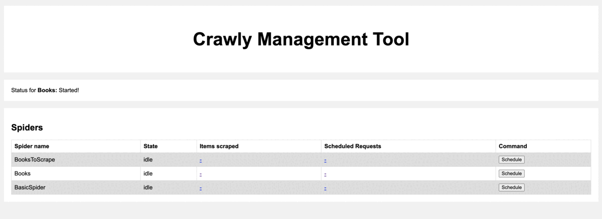

# Crawly

[](https://app.circleci.com/pipelines/github/elixir-crawly)
[](https://coveralls.io/github/elixir-crawly/crawly?branch=master)
[](https://hex.pm/packages/crawly)
[](https://hexdocs.pm/crawly/)
[](https://hex.pm/packages/crawly)
[](https://github.com/elixir-crawly/crawly/blob/master/LICENSE)
[](https://github.com/elixir-crawly/crawly/commits/master)

## Overview

Crawly is an application framework for crawling web sites and
extracting structured data which can be used for a wide range of
useful applications, like data mining, information processing or
historical archival.

## Requirements

1. Elixir `~> 1.14`
2. Works on GNU/Linux, Windows, macOS X, and BSD.


## Quickstart
0. Create a new project: `mix new quickstart --sup`
1. Add Crawly as a dependencies:

   ```elixir
   # mix.exs
   defp deps do
       [
         {:crawly, "~> 0.15.0"},
         {:floki, "~> 0.33.0"}
       ]
   end
   ```
2. Fetch dependencies: `$ mix deps.get`
3. Create a spider

   ```elixir
    # lib/crawly_example/books_to_scrape.ex
    defmodule BooksToScrape do
      use Crawly.Spider

      @impl Crawly.Spider
      def base_url(), do: "https://books.toscrape.com/"

      @impl Crawly.Spider
      def init() do
        [start_urls: ["https://books.toscrape.com/"]]
      end

      @impl Crawly.Spider
      def parse_item(response) do
        # Parse response body to document
        {:ok, document} = Floki.parse_document(response.body)

        # Create item (for pages where items exists)
        items =
          document
          |> Floki.find(".product_pod")
          |> Enum.map(fn x ->
            %{
              title: Floki.find(x, "h3 a") |> Floki.attribute("title") |> Floki.text(),
              price: Floki.find(x, ".product_price .price_color") |> Floki.text(),
              url: response.request_url
            }
          end)

        next_requests =
          document
          |> Floki.find(".next a")
          |> Floki.attribute("href")
          |> Enum.map(fn url ->
            Crawly.Utils.build_absolute_url(url, response.request.url)
            |> Crawly.Utils.request_from_url()
          end)

        %{items: items, requests: next_requests}
      end
    end
   ```

    **New in 0.15.0 :**

    > It's possible to use the command to speed up the spider creation,
    so you will have a generated file with all needed callbacks:
    `mix crawly.gen.spider --filepath ./lib/crawly_example/books_to_scrape.ex --spidername BooksToScrape`


4. Configure Crawly

   By default, Crawly does not require any configuration. But obviously you will need a configuration for fine tuning the crawls:
   (in file: `config/config.exs`)

   ```elixir

    import Config

    config :crawly,
      closespider_timeout: 10,
      concurrent_requests_per_domain: 8,
      closespider_itemcount: 100,

      middlewares: [
        Crawly.Middlewares.DomainFilter,
        Crawly.Middlewares.UniqueRequest,
        {Crawly.Middlewares.UserAgent, user_agents: ["Crawly Bot"]}
      ],
      pipelines: [
        {Crawly.Pipelines.Validate, fields: [:url, :title, :price]},
        {Crawly.Pipelines.DuplicatesFilter, item_id: :title},
        Crawly.Pipelines.JSONEncoder,
        {Crawly.Pipelines.WriteToFile, extension: "jl", folder: "/tmp"}
      ]

   ```

    **New in 0.15.0:**

    > You can generate  example config with the help of the following command:
   `mix crawly.gen.config`

5. Start the Crawl:

   ```bash
     iex -S mix run -e "Crawly.Engine.start_spider(BooksToScrape)"
   ```

6. Results can be seen with:

   ```
   $ cat /tmp/BooksToScrape_<timestamp>.jl
   ```

## Running Crawly without Elixir or Elixir projects

It's possible to run Crawly in a standalone mode, when Crawly is running as a tiny docker container, and spiders are just YMLfiles or elixir modules that are mounted inside.

Please read more about it here:
- [Standalone Crawly](./documentation/standalone_crawly.md)
- [Spiders as YML](./documentation/spiders_in_yml.md)

## Need more help?

Please use discussions for all conversations related to the project

## Browser rendering

Crawly can be configured in the way that all fetched pages will be browser rendered,
which can be very useful if you need to extract data from pages which has lots
of asynchronous elements (for example parts loaded by AJAX).

You can read more here:
- [Browser Rendering](https://hexdocs.pm/crawly/basic_concepts.html#browser-rendering)

## Simple management UI (New in 0.15.0) {#management-ui}
Crawly provides a simple management UI by default on the `localhost:4001`

It allows to:
 - Start spiders
 - Stop spiders
 - Preview scheduled requests
 - View/Download items extracted
 - View/Download logs

You can choose to run the management UI as a plug in your application. 

```elixir
defmodule MyApp.Router do
  use Plug.Router

  ...
  forward "/admin", to: Crawly.API.Router
  ...
end
```




## Experimental UI [Deprecated]

Now don't have a possibility to work on experimental UI built with Phoenix and LiveViews, and keeping it here for
mainly demo purposes.

The CrawlyUI project is an add-on that aims to provide an interface for managing and rapidly developing spiders.
Checkout the code from [GitHub](https://github.com/oltarasenko/crawly_ui)

## Documentation

- [API Reference](https://hexdocs.pm/crawly/api-reference.html#content)
- [Quickstart](https://hexdocs.pm/crawly/readme.html#quickstart)

## Roadmap

To be discussed

## Articles

1. Blog post on Erlang Solutions website: https://www.erlang-solutions.com/blog/web-scraping-with-elixir.html
2. Blog post about using Crawly inside a machine learning project with Tensorflow (Tensorflex): https://www.erlang-solutions.com/blog/how-to-build-a-machine-learning-project-in-elixir.html
3. Web scraping with Crawly and Elixir. Browser rendering: https://medium.com/@oltarasenko/web-scraping-with-elixir-and-crawly-browser-rendering-afcaacf954e8
4. Web scraping with Elixir and Crawly. Extracting data behind authentication: https://oltarasenko.medium.com/web-scraping-with-elixir-and-crawly-extracting-data-behind-authentication-a52584e9cf13
5. [What is web scraping, and why you might want to use it?](https://oltarasenko.medium.com/what-is-web-scraping-and-why-you-might-want-to-use-it-a0e4b621f6d0?sk=3145cceff095523c88e72e3ddb456016)
6. [Using Elixir and Crawly for price monitoring](https://oltarasenko.medium.com/using-elixir-and-crawly-for-price-monitoring-7364d345fc64?sk=9788899eb8e1d1dd6614d022eda350e8)
7. [Building a Chrome-based fetcher for Crawly](https://oltarasenko.medium.com/building-a-chrome-based-fetcher-for-crawly-a779e9a8d9d0?sk=2dbb4d39cdf319f01d0fa7c05f9dc9ec)

## Example projects

1. Blog crawler: https://github.com/oltarasenko/crawly-spider-example
2. E-commerce websites: https://github.com/oltarasenko/products-advisor
3. Car shops: https://github.com/oltarasenko/crawly-cars
4. JavaScript based website (Splash example): https://github.com/oltarasenko/autosites

## Contributors

We would gladly accept your contributions!

## Documentation
Please find documentation on the [HexDocs](https://hexdocs.pm/crawly/)

## Production usages

Using Crawly on production? Please let us know about your case!

## Copyright and License

Copyright (c) 2019 Oleg Tarasenko

Licensed under the Apache License, Version 2.0 (the "License");
you may not use this file except in compliance with the License.
You may obtain a copy of the License at [http://www.apache.org/licenses/LICENSE-2.0](http://www.apache.org/licenses/LICENSE-2.0)

Unless required by applicable law or agreed to in writing, software
distributed under the License is distributed on an "AS IS" BASIS,
WITHOUT WARRANTIES OR CONDITIONS OF ANY KIND, either express or implied.
See the License for the specific language governing permissions and
limitations under the License.


## How to release:

1. Update version in mix.exs
2. Update version in quickstart (README.md, this file)
3. Commit and create a new tag: `git commit && git tag 0.xx.0 && git push origin master --follow-tags`
4. Build docs: `mix docs`
5. Publish hex release: `mix hex.publish`
