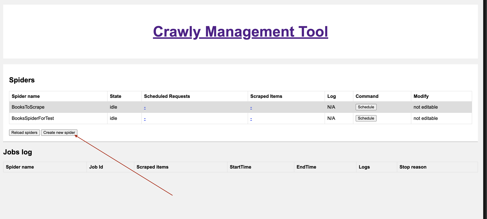
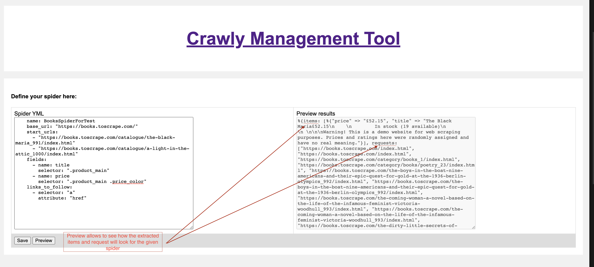

# Defining spiders in YML

Starting from version 0.15.0, Crawly has added the possibility to define spiders as YML files directly from Crawly’s management interface. The main idea is to reduce the amount of boilerplate when defining simple spiders.

You should not write code to get titles and descriptions from Reddit (we hope :)

## Quickstart
1. Start the Crawly application (either using the classical, dependency-based approach or as a standalone application)
2. Open Crawly Management interface (localhost:4001)

3. Define the spider using the following structure:
``` yml
name: BooksSpiderForTest
base_url: "https://books.toscrape.com/"
start_urls:
    - "https://books.toscrape.com/catalogue/a-light-in-the-attic_1000/index.html"
fields:
    - name: title
    selector: ".product_main"
    - name: price
    selector: ".product_main .price_color"
links_to_follow:
    - selector: "a"
    attribute: "href"
```

4. Click Preview button, to see how extracted data will look like after the spider is created:


5. Now after saving the spider it will be possible to Schedule the spider using the Crawly Management interface.

## YML Spider Structure

 * "name" (required): A string representing the name of the scraper.
 * "base_url" (required): A string representing the base URL of the website being scraped. The value must be a valid URI.
 * "start_urls" (required): An array of strings representing the URLs to start scraping from. Each URL must be a valid URI.
 * "links_to_follow" (required): An array of objects representing the links to follow when scraping a page. Each object must have the following properties:
    * "selector": A string representing the CSS selector for the links to follow.
    * "attribute": A string representing the attribute of the link element that contains the URL to follow.
 * "fields" (required): An array of objects representing the fields to scrape from each page. Each object must have the following properties:
    * "name": A string representing the name of the field.
    * "selector": A string representing the CSS selector for the field to scrape.
