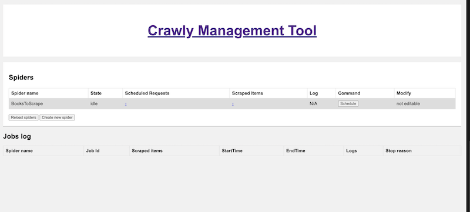
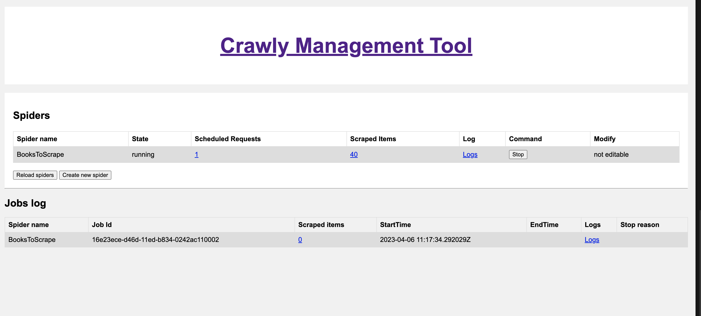

# Running Crawly as a standalone application

An approach that involves abstracting all scraping tasks into a separate entity (or service), thereby allowing you to extract your desired data without the need for Crawly in your mix file.

In other words:
```
Run Crawly as a Docker container with spiders mounted from the outside.
```

# Getting started

Here we will show how re-implement the example from Quickstart, to achieve the same results with a standalone version of Crawly.

 1. Make a folder for your project: `mkdir myproject`
 2. Make spiders folder inside the project folder: `mkdir ./myproject/spiders`
 3. Copy the spider code inside a file in a folder defined on the previous step `myproject/spiders/books_to_scrape.ex`:
    ``` elixir
    defmodule BooksToScrape do
        use Crawly.Spider
        @impl Crawly.Spider
        def base_url(), do: "https://books.toscrape.com/"
        @impl Crawly.Spider
        def init() do
            [start_urls: ["https://books.toscrape.com/"]]
        end
        @impl Crawly.Spider
        def parse_item(response) do
            # Parse response body to document
            {:ok, document} = Floki.parse_document(response.body)
            # Create item (for pages where items exists)
            items =
            document
            |> Floki.find(".product_pod")
            |> Enum.map(fn x ->
                %{
                title: Floki.find(x, "h3 a") |> Floki.attribute("title") |> Floki.text(),
                price: Floki.find(x, ".product_price .price_color") |> Floki.text(),
                url: response.request_url
                }
            end)
            next_requests =
            document
            |> Floki.find(".next a")
            |> Floki.attribute("href")
            |> Enum.map(fn url ->
                Crawly.Utils.build_absolute_url(url, response.request.url)
                |> Crawly.Utils.request_from_url()
            end)
            %{items: items, requests: next_requests}
        end
    end
    ```
    3. Now create a configuration file using erlang.config format:
    https://www.erlang.org/doc/man/config.html

        For example: `myproject/crawly.config`
        ``` erlang
        [{crawly, [
            {closespider_itemcount, 500},
            {closespider_timeout, 20},
            {concurrent_requests_per_domain, 2},

            {middlewares, [
                'Elixir.Crawly.Middlewares.DomainFilter',
                'Elixir.Crawly.Middlewares.UniqueRequest',
                'Elixir.Crawly.Middlewares.RobotsTxt',
                {'Elixir.Crawly.Middlewares.UserAgent', [
                    {user_agents, [<<"Crawly BOT">>]}
                ]}
            ]},

            {pipelines, [
                {'Elixir.Crawly.Pipelines.Validate', [{fields, [title, url]}]},
                {'Elixir.Crawly.Pipelines.DuplicatesFilter', [{item_id, title}]},
                {'Elixir.Crawly.Pipelines.JSONEncoder'},
                {'Elixir.Crawly.Pipelines.WriteToFile', [{folder, <<"/tmp">>}, {extension, <<"jl">>}]}
                ]
            }]
        }].
        ```

    4. Now lets start the Crawly (First pull it from DockerHub: `docker pull oltarasenko/crawly:0.15.0`):
        ```
        docker run --name crawly -e "SPIDERS_DIR=/app/spiders" \
         -it -p 4001:4001 -v $(pwd)/spiders:/app/spiders \
         -v $(pwd)/crawly.config:/app/config/crawly.config \
         crawly
        ```

        You can either fetch the latest version of Crawly from DockerHub or built it yourself (`docker build -t crawly .`)

        ** SPIDERS_DIR environment variable specifies a folder from which additional spiders are going to be fetched. `./spiders` is used by default

    5. Open Crawly Web Management interface in your browser: https://localhost:4001/

    Here it's possible to Schedule a spider with a use of Schedule button. The interface also allows you to access other useful information like:
    1. History of your jobs
    2. Items
    3. Logs of the given spider

    
    


